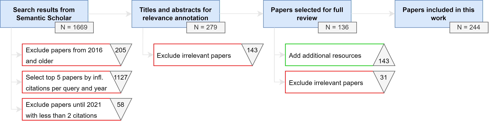

# Text Generation: A Systematic Literature Review of Tasks, Evaluation, and Challenges

[](https://arxiv.org/abs/2405.15604)

This is the official repository for the paper **Text Generation: A Systematic Literature Review of Tasks, Evaluation, and Challenges**.

This repository is under construction. Please be patient until we add more information. Thank you!

## Methodology
The paper documents the detailed pipeline of this systematic literature review. This figure gives you an overview of how we sample 244 works relevant to text generation.



## Text Generation Tasks
Our literature review identifies five most prominent areas related to text generation, namely open-ended text generation,
summarization, translation, paraphrasing, and question answering.

| **Task**       | **Description** |
|-----------------|--------------|
| Open-ended text generation  | Newly generated text is iteratively conditioned on the previous context.    |
| Summarization         |   Generating a text from one or more texts conveying information in a shorter format.     |
| Translation      |  Converting a source text in language A to a target language B.    |
| Paraphrasing    |  Generating text that has (approximately) identical meaning but uses different words or structures.   |
| Question answering    |  Takes a question as input text and outputs a streamlined answer or a list of possible answers.  |

For each of these tasks, we identify major sub-tasks and relevant challenges.

<p align="center">
  
</p>

## Evaluation Metrics
We provide an overview of model-free and model-based automatic metrics as well as methodologies for human evaluation. "Used" marks the number of papers that consider the metric in
their publication from our 136 filtered Semantic Scholar documents (proposing, surveying, or applying).

We find that model-free n-gram-based metrics are by far the most used metrics within the works we cover. Model-based approaches are usually employed in a hybrid manner, combining embeddings with rule-based methods. Several works use human evaluation for performance measurements while often disregarding inter-annotator agreement scores.

| **Type**       | **Category** | **Metric**       | **Description**                                                                               | **Used** |
|-----------------|--------------|------------------|-----------------------------------------------------------------------------------------------|----------|
| **Model-free**      | N-gram       | [BLEU](https://www.aclweb.org/anthology/P02-1040/) | Textual overlap between source and reference (precision).                                    | 69       |
|                 |              | [ROUGE](https://www.aclweb.org/anthology/W04-1013/) | Textual overlap between source and reference (recall).                                       | 46       |
|                 |              | [METEOR](https://www.aclweb.org/anthology/W05-0909/) | Textual overlap between source and reference (precision and recall).                         | 32       |
|                 |              | [CIDEr](https://openaccess.thecvf.com/content_cvpr_2015/html/Vedantam_CIDEr_Consensus-Based_Image_2015_CVPR_paper.html) | Measures consensus on multiple reference texts.                                               | 15       |
|                 |              | [chrF++](https://www.aclweb.org/anthology/W17-4770/) | Character-based F-score computed using n-grams.                                              | 13       |
|                 |              | [Dist-n](https://www.aclweb.org/anthology/N16-1014/) | Measures generation diversity by the percentage of distinct n-grams.                         | 8        |
|                 |              | [NIST](https://dl.acm.org/doi/10.5555/1289189.1289273) | Alters BLEU to also consider n-gram informativeness.                                         | 6        |
|                 |              | [Self-BLEU](https://dl.acm.org/doi/10.1145/3209978.3210080) | Measures generation diversity by calculating BLEU between generated samples.                 | 2        |
|                 | Statistical  | [Perplexity](https://aclanthology.org/2023.acl-long.13/) | Fluency metric based on the likelihood of word sequences.                                    | 23       |
|                 |              | [Word Error Rate](https://aclanthology.org/D18-1150/) | The rate of words that are different from a reference sequence based on the Levenshtein distance. | 11       |
|                 | Graph        | [SPICE](https://link.springer.com/chapter/10.1007/978-3-319-46454-1_24) | Measures the semantic similarity of two texts by the distance of their scene graphs.         | 6        |
| | | | | |
| **Model-based**     | Hybrid       | [BERTScore](https://arxiv.org/abs/1904.09675) | Contextual token similarity to measure textual overlap.                                      | 13       |
|                 |              | [MoverScore](https://aclanthology.org/D19-1053/) | Uses contextualized embeddings and captures both intersection and deviation from the reference for a similarity score. | 6        |
|                 |              | [Word Mover Distance](https://proceedings.mlr.press/v37/kusnerb15.html) | Distance metric to measure the dissimilarity of two texts. | 2        |
|                 | Trained      | [BLEURT](https://aclanthology.org/2020.acl-main.704/) | Models human judgement on text quality. | 4        |
|                 |              | [BARTScore](https://proceedings.neurips.cc/paper/2021/hash/e4d2b6e6fdeca3e60e0f1a62fee3d9dd-Abstract.html) | Promptable metric that models human judgments on faithfulness besides precision and recall. | 3        |
| | | | | |
| **Human**       | Performance    | [Likert Scale](https://psycnet.apa.org/record/1933-01885-001)                           | Humans can choose on a scale, e.g., from 1 (horrible quality) to 5 (perfect quality).         | 22    |
|             |                | [Pairwise Comparison](https://aclanthology.org/W18-6556/)         | Humans choose the best example from two samples.                                              | 10    |
|             |                | [Turing Test](https://www.ijcai.org/proceedings/2018/606)              | Can quantify how distinguishable human text is from machine-generated text.                   | 6     |
|             |                | [Binary](https://dl.acm.org/doi/10.1145/3184558.3186345)                 | Humans are answering binary questions with yes or no.                                         | 3     |
|             |                | [Best-Worst Scaling](https://journals.sagepub.com/doi/10.1177/074391569201100202)                       | From a list of examples, humans are instructed to select the best and worst output.           | 2     |
|             | Agreement      | [Krippendorff Alpha](https://www.jstor.org/stable/270787?origin=crossref)              | Measures the disagreement between annotators for nominal, ordinal, and metric data.           | 4     |
|             |                | [Fleiss Kappa](https://psycnet.apa.org/doiLanding?doi=10.1037%2Fh0031619)                | Measures the agreement on nominal data between a fixed pair of annotators.                    | 4     |
|             |                | [Pearson Correlation](https://aclanthology.org/2020.acl-main.167/)     | Displays the agreement between annotators by measuring linear correlation.                    | 3     |
|             |                | [Spearman Correlation](https://dl.acm.org/doi/10.1145/3442188.3445924) | Displays the monotonic relationships on ranked data.                                          | 2     |

## Pipeline

### Remarks

The number of works that we retrieve through our systematic pipeline drops off after 2022 (see the figure below).
Additionally, the average number of citations drops, indicating that citations are not a good factor for measuring paper relevance for recent papers.
To improve coverage, we do not exclude papers from 2022+ by the citation criterion and supplement our selection of works with additional and more recent works.

<p float="left">
  
   
</p>

### Manual Filtering

We reduced 279 papers to 136 papers by reading their titles and abstracts.
You can download a PDF containing our relevance judgments [here](https://github.com/jonas-becker/review-on-machine-generated-text/blob/main/relevance_judgements.pdf).

---

## Setup

We recommend using Python 3.10 for this project.

First, install the requirements:
```pip install -r requirements.txt```

---

### Code

The project has multiple scripts included, each used for separate parts of the pipeline.

1) `setup.py`: Defines the parameters used for searching and filtering the scientific works.
1) `tokens.py`: You need an API key to use the Semantic Scholar API. This is the place to put it.
2) `search.py`: The initial retrieval of scientific works through the Semantic Scholar API.
3) `filter.py`: The automated filtering process that selects the top five works per query and year by influential citation counts.

## Citation
If you use this repository or our paper for your research work, please cite us in the following way.

```
@misc{becker2024text,
      title={Text Generation: A Systematic Literature Review of Tasks, Evaluation, and Challenges}, 
      author={Jonas Becker and Jan Philip Wahle and Bela Gipp and Terry Ruas},
      year={2024},
      eprint={2405.15604},
      archivePrefix={arXiv},
      primaryClass={cs.CL}
}
```
